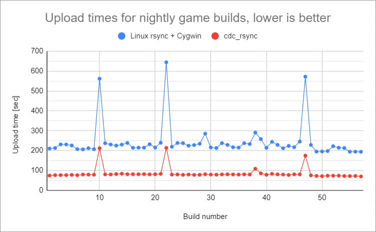
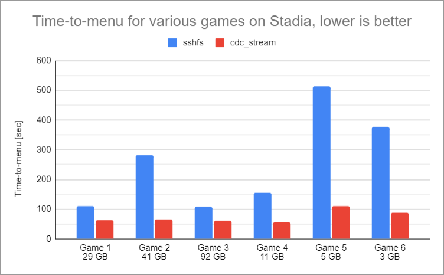

# CDC File Transfer

Born from the ashes of Stadia, this repository contains tools for synching and
streaming files from Windows to Linux. They are based on Content Defined
Chunking (CDC), in particular
[FastCDC](https://www.usenix.org/conference/atc16/technical-sessions/presentation/xia),
to split up files into chunks.

## History

At Stadia, game developers had access to Linux cloud instances to run games.
Most developers wrote their games on Windows, though. Therefore, they needed a
way to make them available on the remote Linux instance.

As developers had SSH access to those instances, they could use `scp` to copy
the game content. However, this was impractical, especially with the shift to
working from home during the pandemic with sub-par internet connections. `scp`
always copies full files, there is no "delta mode" to copy only the things that
changed, it is slow for many small files, and there is no fast compression.

To help this situation, we developed two tools, `cdc_rsync` and `cdc_stream`,
which enable developers to quickly iterate on their games without repeatedly
incurring the cost of transmitting dozens of GBs.

## CDC RSync

`cdc_rsync` is a tool to sync files from a Windows machine to a Linux device,
similar to the standard Linux [rsync](https://linux.die.net/man/1/rsync). It is
basically a copy tool, but optimized for the case where there is already an old
version of the files available in the target directory.
* It quickly skips files if timestamp and file size match.
* It uses fast compression for all data transfer.
* If a file changed, it determines which parts changed and only transfers the
  differences.

<p align="center">
  
</p>

The remote diffing algorithm is based on CDC. In our tests, it is up to 30x
faster than the one used in rsync (1500 MB/s vs 50 MB/s).

The following chart shows a comparison of `cdc_rsync` and Linux rsync running
under Cygwin on Windows. The test data consists of 58 development builds
of some game provided to us for evaluation purposes. The builds are 40-45 GB
large. For this experiment, we uploaded the first build, then synced the second
build with each of the two tools and measured the time. For example, syncing
from build 1 to build 2 took 210 seconds with the Linux rsync, but only 75
seconds with `cdc_rsync`. The three outliers are probably feature drops from
another development branch, where the delta was much higher. Overall,
`cdc_rsync` syncs files about **3 times faster** than Linux rsync.

<p align="center">
  
</p>

## CDC Stream

`cdc_stream` is a tool to stream files and directories from a Windows machine to a
Linux device. Conceptually, it is similar to [sshfs](https://github.com/libfuse/sshfs),
but it is optimized for read speed.
* It caches streamed data on the Linux device.
* If a file is re-read on Linux after it changed on Windows, only the
  differences are streamed again. The rest is read from the cache.
* Stat operations are very fast since the directory metadata (filenames,
  permissions etc.) is provided in a streaming-friendly way.

To efficiently determine which parts of a file changed, the tool uses the same
CDC-based diffing algorithm as `cdc_rsync`. Changes to Windows files are almost
immediately reflected on Linux, with a delay of roughly (0.5s + 0.7s x total
size of changed files in GB).

<p align="center">
  
</p>

The tool does not support writing files back from Linux to Windows; the Linux
directory is readonly.

The following chart compares times from starting a game to reaching the menu.
In one case, the game is streamed via `sshfs`, in the other case we use
`cdc_stream`. Overall, we see a **2x to 5x speedup**.

<p align="center">
  
</p>

# Getting Started

Download the precompiled binaries from the
[latest release](https://github.com/google/cdc-file-transfer/releases).
We currently provide Linux binaries compiled on
[Github's latest Ubuntu](https://github.com/actions/runner-images) version.
If the binaries work for you, you can skip the following two sections.

Alternatively, the project can be built from source. Some binaries have to be
built on Windows, some on Linux.

## Prerequisites

To build the tools from source, the following steps have to be executed on
**both Windows and Linux**.

* Download and install Bazel from [here](https://bazel.build/install). See
  [workflow logs](https://github.com/google/cdc-file-transfer/actions) for the
  currently used version.
* Clone the repository.
  ```
  git clone https://github.com/google/cdc-file-transfer
  ```
* Initialize submodules.
  ```
  cd cdc-file-transfer
  git submodule update --init --recursive
  ```

Finally, install an SSH client on the Windows device if not present.
The file transfer tools require `ssh.exe` and `scp.exe`.

## Building

The two tools can be built and used independently.

### CDC RSync

* Build Linux components
  ```
  bazel build --config linux --compilation_mode=opt --linkopt=-Wl,--strip-all --copt=-fdata-sections --copt=-ffunction-sections --linkopt=-Wl,--gc-sections //cdc_rsync_server
  ```
* Build Windows components
  ```
  bazel build --config windows --compilation_mode=opt --copt=/GL //cdc_rsync
  ```
* Copy the Linux build output file `cdc_rsync_server` from 
  `bazel-bin/cdc_rsync_server` on the Linux system to `bazel-bin\cdc_rsync`
  on the Windows machine.

### CDC Stream

* Build Linux components
  ```
  bazel build --config linux --compilation_mode=opt --linkopt=-Wl,--strip-all --copt=-fdata-sections --copt=-ffunction-sections --linkopt=-Wl,--gc-sections //cdc_fuse_fs
  ```
* Build Windows components
  ```
  bazel build --config windows --compilation_mode=opt --copt=/GL //cdc_stream
  ```
* Copy the Linux build output files `cdc_fuse_fs` and `libfuse.so` from 
  `bazel-bin/cdc_fuse_fs` on the Linux system to `bazel-bin\cdc_stream`
  on the Windows machine.

## Usage

The tools require a setup where you can use SSH and SCP from the Windows machine
to the Linux device without entering a password, e.g. by using key-based
authentication.

### Configuring SSH and SCP

By default, the tools search `ssh.exe` and `scp.exe` from the path environment
variable. If you can run the following commands in a Windows cmd without
entering your password, you are all set:
```
ssh user@linux.device.com
scp somefile.txt user@linux.device.com:
```
Here, `user` is the Linux user and `linux.device.com` is the Linux host to
SSH into or copy the file to.

If `ssh.exe` or `scp.exe` cannot be found, or if additional arguments are
required, it is recommended to set the environment variables `CDC_SSH_COMMAND`
and `CDC_SCP_COMMAND`. The following example specifies a custom path to the SSH
and SCP binaries, a custom SSH config file, a key file and a known hosts file:
```
set CDC_SSH_COMMAND="C:\path with space\to\ssh.exe" -F C:\path\to\ssh_config -i C:\path\to\id_rsa -oStrictHostKeyChecking=yes -oUserKnownHostsFile="""C:\path\to\known_hosts"""
set CDC_SCP_COMMAND="C:\path with space\to\scp.exe" -F C:\path\to\ssh_config -i C:\path\to\id_rsa -oStrictHostKeyChecking=yes -oUserKnownHostsFile="""C:\path\to\known_hosts"""
```

#### Google Specific

For Google internal usage, set the following environment variables to enable SSH
authentication using a Google security key:
```
set CDC_SSH_COMMAND=C:\gnubby\bin\ssh.exe
set CDC_SCP_COMMAND=C:\gnubby\bin\scp.exe
```
Note that you will have to touch the security key multiple times during the
first run. Subsequent runs only require a single touch.

### CDC RSync

`cdc_rsync` is used similar to `scp` or the Linux `rsync` command. To sync a
single Windows file `C:\path\to\file.txt` to the home directory `~` on the Linux
device `linux.device.com`, run
```
cdc_rsync C:\path\to\file.txt user@linux.device.com:~
```
`cdc_rsync` understands the usual Windows wildcards `*` and `?`.
```
cdc_rsync C:\path\to\*.txt user@linux.device.com:~
```
To sync the contents of the Windows directory `C:\path\to\assets` recursively to
`~/assets` on the Linux device, run
```
cdc_rsync C:\path\to\assets\* user@linux.device.com:~/assets -r
```
To get per file progress, add `-v`:
```
cdc_rsync C:\path\to\assets\* user@linux.device.com:~/assets -vr
```

### CDC Stream

To stream the Windows directory `C:\path\to\assets` to `~/assets` on the Linux
device, run
```
cdc_stream start C:\path\to\assets user@linux.device.com:~/assets
```
This makes all files and directories in `C:\path\to\assets` available on
`~/assets` immediately, as if it were a local copy. However, data is streamed
from Windows to Linux as files are accessed.

To stop the streaming session, enter
```
cdc_stream stop user@linux.device.com:~/assets
```
The command also accepts wildcards. For instance, 
```
cdc_stream stop user@*:*
```
stops all existing streaming sessions for the given user.

## Troubleshooting

On first run, `cdc_stream` starts a background service, which does all the work.
The `cdc_stream start` and `cdc_stream stop` commands are just RPC clients that
talk to the service.

The service logs to `%APPDATA%\cdc-file-transfer\logs` by default. The logs are
useful to investigate issues with asset streaming. To pass custom arguments, or
to debug the service, create a JSON config file at
`%APPDATA%\cdc-file-transfer\cdc_stream.json` with command line flags.
For instance,
```
{ "verbosity":3 }
```
instructs the service to log debug messages. Try `cdc_stream start-service -h`
for a list of available flags. Alternatively, run the service manually with
```
cdc_stream start-service
```
and pass the flags as command line arguments. When you run the service manually,
the flag `--log-to-stdout` is particularly useful as it logs to the console
instead of to the file.

`cdc_rsync` always logs to the console. To increase log verbosity, pass `-vvv`
for debug logs or `-vvvv` for verbose logs.

For both sync and stream, the debug logs contain all SSH and SCP commands that
are attempted to run, which is very useful for troubleshooting. If a command
fails unexpectedly, copy it and run it in isolation. Pass `-vv` or `-vvv` for
additional debug output.
